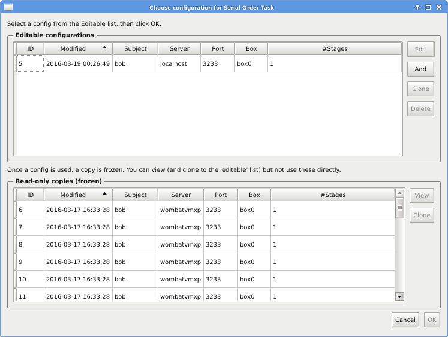
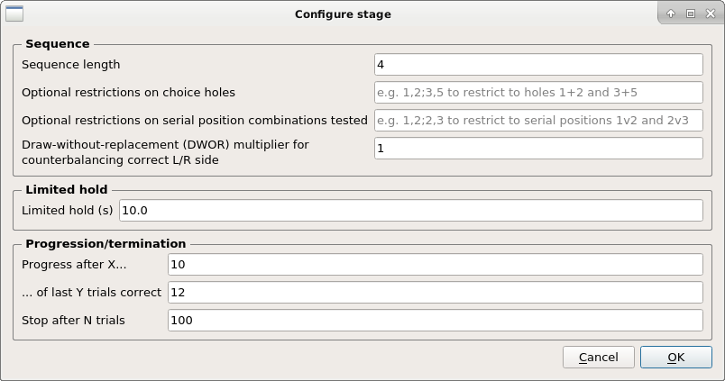

..  docs/source/task_operation.rst

..  Copyright © 2016-2018 Rudolf Cardinal (rudolf@pobox.com).
    .
    Licensed under the Apache License, Version 2.0 (the "License");
    you may not use this file except in compliance with the License.
    You may obtain a copy of the License at
    .
        http://www.apache.org/licenses/LICENSE-2.0
    .
    Unless required by applicable law or agreed to in writing, software
    distributed under the License is distributed on an "AS IS" BASIS,
    WITHOUT WARRANTIES OR CONDITIONS OF ANY KIND, either express or implied.
    See the License for the specific language governing permissions and
    limitations under the License.

Task operation
==============

When you start successfully, it’ll look like this:

First, configure:

At the top are *editable* configurations. Edit them, and then select one (and
click OK) when you’re ready to run. When you run a task, the program *copies
the editable config into a ‘frozen’ state* so it’s permanently accessible.
These frozen copies are shown at the bottom. (You can ‘clone’ a frozen config
back into the editable list, as well.)

When you edit a config, you see this:

Note that the default Whisker server is **localhost** (meaning “this computer”)
and the default TCP/IP port [#whiskerport]_ is **3233**. The device group (box)
setting should match a device group specified in your Whisker device definition
file [#ddf]_.

When you edit a stage definition, you see this:

When you’re happy with everything, select the config and click **Start** at the
main screen. The program will attempt to connect to Whisker and run the task.

Data is logged ‘live’ to the database, with a COMMIT at the end of every server
event processed.

Make sure you use a database with appropriate concurrency
(multi-user/multi-client) support; see :ref:`databases`.

Notes on individual parameters
==============================

Draw-without-replacement multiplier...
--------------------------------------

A draw-without-replacement (DWOR) "multiplier" works as follows (also at
http://www.whiskercontrol.com/help/MonkeyCantab/index.html?monkeycantab_dwor.htm).

- Suppose you have *n* things -- e.g. two things, "left" and "right".
- You have an imaginary hat and you put things into the hat. You put in *m*
  copies of each of the *n* things, where *m* is the DWOR multiplier.

  - So if the DWOR multiplier is 1, you put "left" and "right" into the hat.
  - If the DWOR multiplier is 3, you put "left", "left", "left", "right",
    "right", "right" into the hat.

- You shake the hat to shuffle its contents.
- You draw out one thing at a time, and don't put it back ("draw without
  replacement").
- When you run out, you refill the hat as above.

This task offers a DWOR multipler for the correct side allocation (left or
right).

So, this means that if your DWOR multiplier is 1, then in every 2 trials you
get one L and one R. You can get sequences like L R, R L, L R, L R, R L, R L, R
L, L R. This is good for consistency and local counterbalancing, but it does
mean that every second trial is completely predictable if the subject works out
the rule.

If your DWOR multiplier is 3, then in every 6 trials you get 3 L and 3 R. You
can get sequences like R L L R R L, L L L R R R, L L L R R R, L R R L R L, R R
R L L L, etc.

As your DWOR multiplier moves towards infinity, you move towards "true"
randomness (but experimenters tend to dislike that because it doesn't exclude
very long runs of L L L L L L L... etc., even if they are rare).

Note that you can run the program with the ``--testtrialplan`` option to see a
trial plan and then stop (see ``--help`` for more options). Try, for example:

.. code-block:: none

    whisker_serial_order --testtrialplan --seqlen 2 --side_dwor_multiplier 1
    whisker_serial_order --testtrialplan --seqlen 2 --side_dwor_multiplier 3

.. rubric:: Footnotes

.. [#fiveholebox]

    Rodent five-choice task: Carli et al. (1983), PubMed ID `6639741
    <https://www.ncbi.nlm.nih.gov/pubmed/6639741>`_.

.. [#whiskerport]

    http://www.iana.org/assignments/service-names-port-numbers/service-names-port-numbers.xhtml?search=whisker

.. [#ddf]

    See http://www.whiskercontrol.com/
