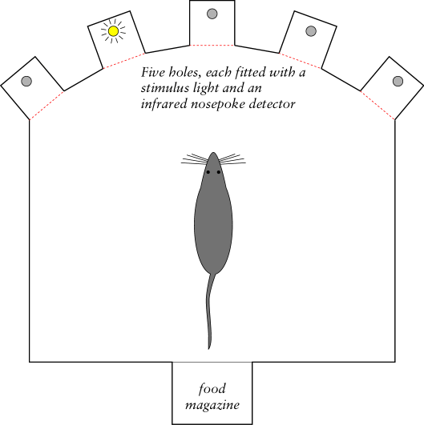

..  docs/source/task_overview.rst

..  Copyright © 2016-2018 Rudolf Cardinal (rudolf@pobox.com).
    .
    Licensed under the Apache License, Version 2.0 (the "License");
    you may not use this file except in compliance with the License.
    You may obtain a copy of the License at
    .
        http://www.apache.org/licenses/LICENSE-2.0
    .
    Unless required by applicable law or agreed to in writing, software
    distributed under the License is distributed on an "AS IS" BASIS,
    WITHOUT WARRANTIES OR CONDITIONS OF ANY KIND, either express or implied.
    See the License for the specific language governing permissions and
    limitations under the License.

Task overview
=============

The task tests memory for serial position/order.

The task operates with a five-hole box (5 holes of the traditional 9-hole
box [#fiveholebox]_), with a rear food magazine at the back. All ‘holes’ have a
light inside and an infrared nosepoke detector; the food magazine can also
dispense pellets. Like this:

In brief, trials are as follows:

- Trials begin with illumination of the food magazine/tray, and the subject
  must respond.

- A sequence of lights is presented. For example, if a 4-light sequence is
  used, the task may aim to present 4-1-3-5. After each individual light
  presentation, the subject must acknowledge by responding to the location of
  the light, and after that to the magazine (again signalled by magazine light
  illumination).

- After the sequence has been presented and acknowledged, a choice of two of
  the presented lights is offered (e.g. 4, 3). The subject must choose the
  correct hole to answer the question: **“which one came first?”** Success
  leads to food.

.. rubric:: Footnotes

.. [#fiveholebox]

    Rodent five-choice task: Carli et al. (1983), PubMed ID `6639741
    <https://www.ncbi.nlm.nih.gov/pubmed/6639741>`_.
