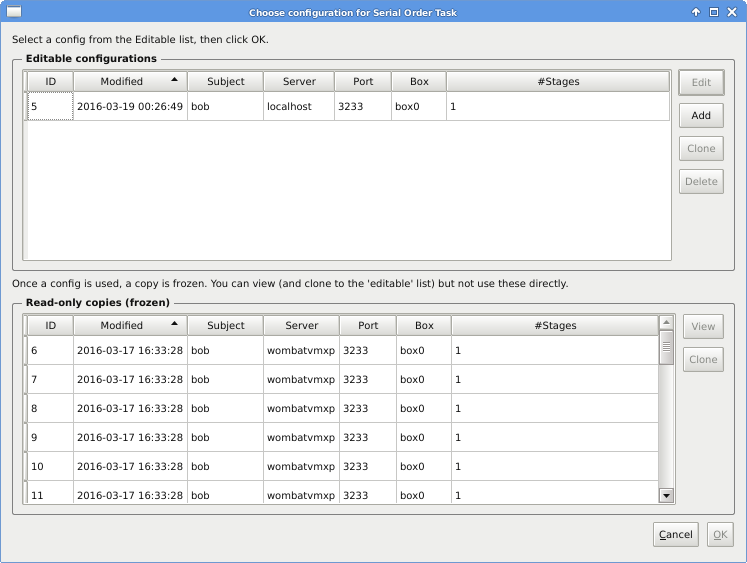
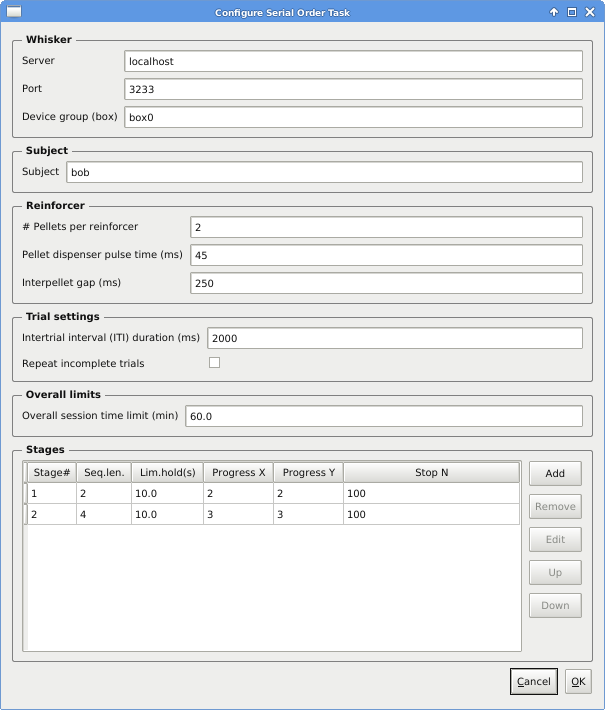
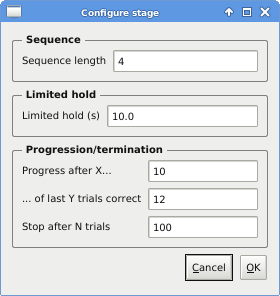

..  whisker_serial_order/docs/source/task_operation.rst

..  Copyright © 2016-2018 Rudolf Cardinal (rudolf@pobox.com).
    .
    Licensed under the Apache License, Version 2.0 (the "License");
    you may not use this file except in compliance with the License.
    You may obtain a copy of the License at
    .
        http://www.apache.org/licenses/LICENSE-2.0
    .
    Unless required by applicable law or agreed to in writing, software
    distributed under the License is distributed on an "AS IS" BASIS,
    WITHOUT WARRANTIES OR CONDITIONS OF ANY KIND, either express or implied.
    See the License for the specific language governing permissions and
    limitations under the License.

Task operation
==============

When you start successfully, it’ll look like this:

.. image:: screenshots/first_screen.png
    :align: center

First, configure:

At the top are *editable* configurations. Edit them, and then select one (and
click OK) when you’re ready to run. When you run a task, the program *copies
the editable config into a ‘frozen’ state* so it’s permanently accessible.
These frozen copies are shown at the bottom. (You can ‘clone’ a frozen config
back into the editable list, as well.)

When you edit a config, you see this:

Note that the default Whisker server is **localhost** (meaning “this computer”)
and the default TCP/IP port [#whiskerport]_ is **3233**. The device group (box)
setting should match a device group specified in your Whisker device definition
file [#ddf]_.

When you edit a stage definition, you see this:

When you’re happy with everything, select the config and click **Start** at the
main screen. The program will attempt to connect to Whisker and run the task.

Data is logged ‘live’ to the database, with a COMMIT at the end of every server
event processed.

Make sure you use a database with appropriate concurrency
(multi-user/multi-client) support; see :ref:`databases`.

.. rubric:: Footnotes

.. [#fiveholebox]

    Rodent five-choice task: Carli et al. (1983), PubMed ID `6639741
    <https://www.ncbi.nlm.nih.gov/pubmed/6639741>`_.

.. [#whiskerport]

    http://www.iana.org/assignments/service-names-port-numbers/service-names-port-numbers.xhtml?search=whisker

.. [#ddf]

    See http://www.whiskercontrol.com/
